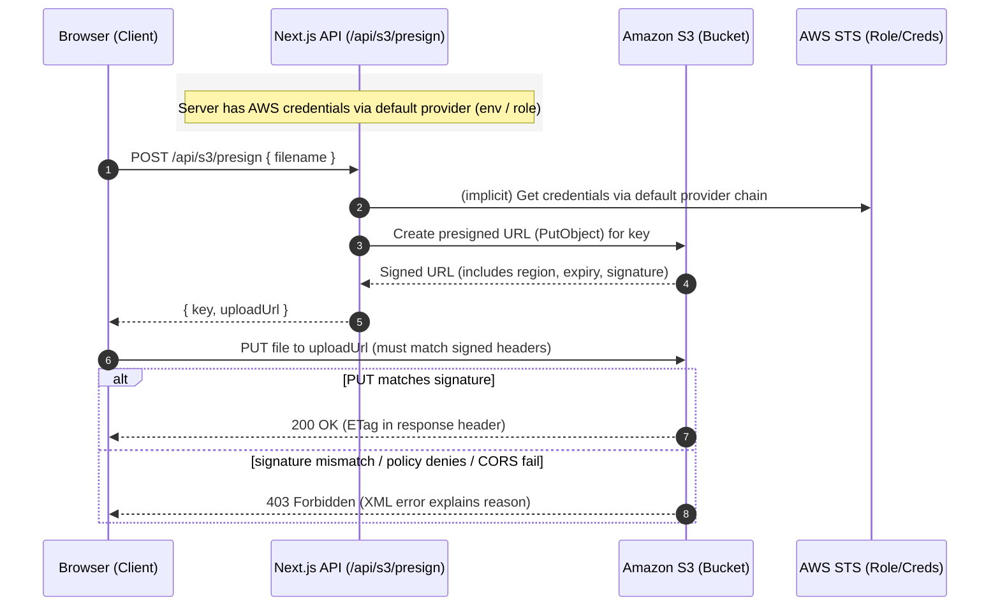
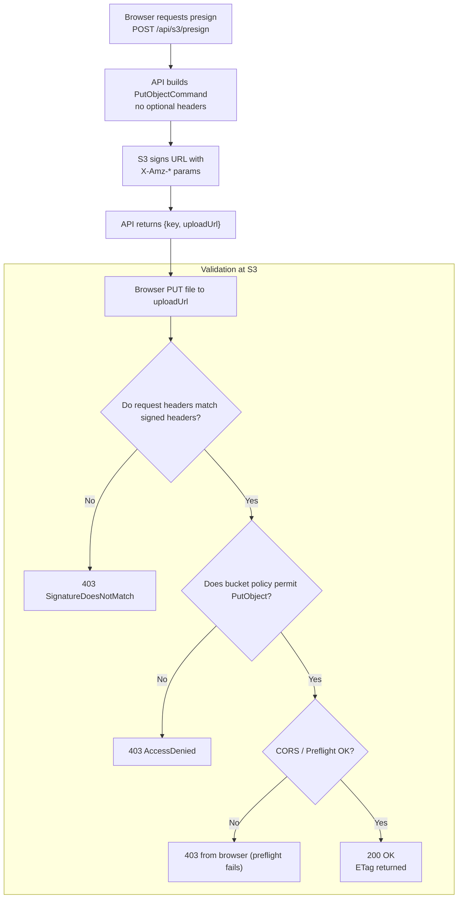
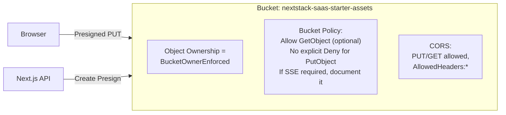

# S3 Presigned PUT – End‑to‑End Flow (Diagrams)

**⚠️ UPDATED:** This document describes the S3 presigned URL mechanics. For the new secure implementation with authentication, authorization, and tracking, see [S3 Operations API Documentation](./api/s3-operations.md).

This doc visualizes the **minimal presigned upload flow** and highlights where a **403** can occur. This version fixes Mermaid parsing errors by quoting any labels that contain curly braces or parentheses.

---

## 1) High‑Level Sequence (Browser ↔ API ↔ S3)

---

## 2) Request Path Flow (with Decision Points) — Fixed

---

## 3) Quick Troubleshooting Map (403 → culprit)

| Symptom | Likely Cause | Fix |
|---|---|---|
| `403 SignatureDoesNotMatch` | Header mismatch (e.g., presign included `Content-Type` but PUT didn’t) | Make presign minimal; or **send exact same headers** in PUT |
| `403 AccessDenied` | Bucket policy denies `PutObject` (SSE required, VPC endpoint condition, wrong key prefix) | Satisfy conditions (e.g., sign & send SSE), or relax policy for presign principal |
| Browser shows CORS error | CORS missing `PUT` or `AllowedHeaders` | Add `PUT` and `AllowedHeaders=["*"]` (or explicit headers) |
| Works with curl, fails in browser | CORS/preflight issue | Same as above; avoid `no-cors` mode |
| Randomly fails later | URL expired or clock skew | Reduce time to test; ensure server clock synced (NTP) |
| Upload to CloudFront URL | Presigned S3 URL used against CF | Use the **S3** endpoint from presign, not CloudFront |

---

## 4) Diagram of Bucket Permissions (Modern “No‑ACL”)

---
