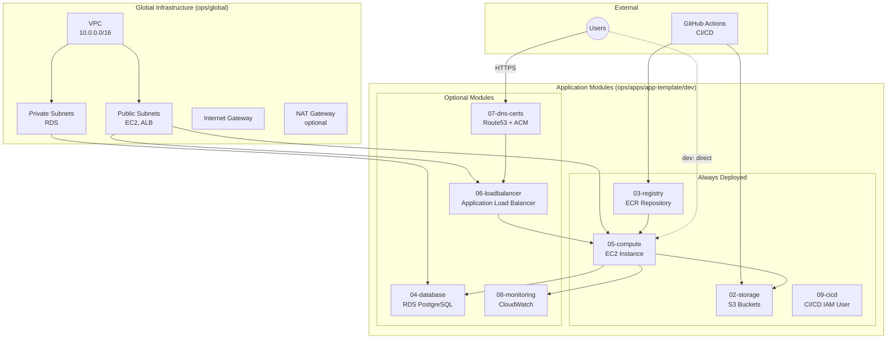

# AWS Architecture

This document outlines the AWS architecture using a **modular Terraform approach**. Infrastructure is deployed as independent modules, allowing you to deploy only what you need and scale up incrementally.

## Architecture Philosophy

- **Modular Design**: Each infrastructure component is a separate Terraform module with its own state file
- **Cost-Optimized**: Deploy only essential modules in development (~$12/month)
- **Production-Ready**: Add optional modules for high availability and security
- **Isolated State**: Independent state files reduce blast radius and enable parallel work

---

## Architecture Diagram



---

## Infrastructure Modules

### Global Infrastructure (ops/global)

**Deployed once per environment, shared by all applications:**

- **VPC**: 10.0.0.0/16 (dev), 10.1.0.0/16 (qa), 10.2.0.0/16 (prod)
- **Public Subnets**: For EC2 instances and ALB
- **Private Subnets**: For RDS databases
- **Internet Gateway**: Public internet access
- **NAT Gateway**: Optional, for private subnet egress
- **CloudTrail**: API activity logging

### Application Modules (ops/apps/app-template/dev)

#### 02-storage (Always Deploy)
**Amazon S3 Buckets**
- **Assets Bucket**: Public read access, versioning enabled
- **Uploads Bucket**: Private with pre-signed URLs, server-side encryption
- **Cost**: ~$2-5/month
- **Dependencies**: None

#### 03-registry (Always Deploy)
**Amazon ECR**
- Private Docker image repository
- Image scanning on push
- Lifecycle policies to retain last N images
- **Cost**: ~$1-2/month
- **Dependencies**: None

#### 04-database (Optional)
**Amazon RDS PostgreSQL**
- Deployed in private subnets
- Automated backups and encryption
- Secrets Manager for credentials
- **Cost**: $15-30/month (dev), $60-100/month (prod with Multi-AZ)
- **Dependencies**: VPC private subnets from global

#### 05-compute (Always Deploy)
**Amazon EC2**
- Dockerized Next.js application
- Instance type: t3.micro (dev), t3.small+ (prod)
- Deployed in public subnets
- IAM role with S3, ECR, and CloudWatch permissions
- **Cost**: ~$8-15/month
- **Dependencies**: Storage, Registry

#### 06-loadbalancer (Optional)
**Application Load Balancer**
- SSL termination with ACM certificates
- Health checks and target groups
- Multi-AZ for high availability
- **Cost**: ~$16-20/month
- **Dependencies**: Compute

#### 07-dns-certs (Optional)
**Route53 + ACM**
- Custom domain configuration
- SSL/TLS certificates with auto-renewal
- DNS validation
- **Cost**: ~$0.50-1/month
- **Dependencies**: Load Balancer

#### 08-monitoring (Recommended)
**Amazon CloudWatch**
- EC2 CPU and memory alarms
- Application logs and metrics
- Custom dashboards
- **Cost**: ~$1-3/month
- **Dependencies**: Compute

#### 09-cicd (Always Deploy)
**CI/CD IAM User**
- Least-privilege IAM user for GitHub Actions
- Access to ECR (push), S3 (upload), EC2 (deploy)
- Credentials stored in Secrets Manager
- **Cost**: Free
- **Dependencies**: Storage, Registry

---

## Data Flow

### 1. Build & Deploy (CI/CD)
```
GitHub Actions → ECR (push image)
GitHub Actions → S3 (upload assets)
GitHub Actions → EC2 (trigger deployment)
EC2 → ECR (pull latest image)
EC2 → Docker (restart container)
```

### 2. User Access Flow

**Development (Direct EC2):**
```
User → EC2 Public IP:80 → Docker Container → Next.js App
```

**Production (with ALB):**
```
User → Route53 DNS → ALB (SSL termination) → EC2 → Docker Container → Next.js App
```

### 3. Static Asset Flow
```
Next.js App → S3 Assets Bucket (public read)
User Browser → S3 Assets Bucket (direct download)
```

### 4. File Upload Flow
```
Next.js App → Generate pre-signed URL
User Browser → S3 Uploads Bucket (direct upload via pre-signed URL)
Next.js App → RDS (store metadata)
```

### 5. Database Access (if deployed)
```
Next.js App → RDS PostgreSQL (private subnet, port 5432)
Next.js App → Secrets Manager (retrieve DB credentials)
```

---

## Security Boundaries

- Network Security
  - VPC with public subnets for EC2; private subnets for RDS
  - NAT Gateway optional (needed if private subnets require internet access)
  - Security groups restrict inbound to 80/443 and restricted SSH

- IAM Security
  - EC2 instance role with least-privilege access: S3 (scoped to buckets), ECR pull for the app repo, and CloudWatch logs/metrics
  - Per app/environment CI IAM user (least privilege), scoped to that app’s ECR repository and S3 buckets; credentials (access key) are stored in AWS Secrets Manager via a named secret (ci_secret_name) for CI pipelines

- Data Security
  - S3 server-side encryption (SSE-S3 or SSE-KMS)
  - TLS via ACM certificates (HTTPS everywhere)
  - Secrets stored in AWS Secrets Manager for RDS credentials (if used)

- Monitoring & Compliance
  - CloudWatch metrics, logs, and alarms
  - CloudTrail for API activity logging

---

## Network Topology

### VPC & Subnets

- CIDR: example 10.0.0.0/16
- Public Subnets: for EC2 and optional ALB (e.g., 10.0.1.0/24, 10.0.2.0/24)
- Private Subnets: for RDS Postgres (e.g., 10.0.21.0/24, 10.0.22.0/24)

### Routing

- Public subnets route via Internet Gateway
- Private subnets route via NAT Gateway (only if outbound internet needed)
- Optional VPC endpoints for S3

---

## Deployment Scenarios

### Minimal Development (~$12/month)
**Modules:** Storage, Registry, Compute, CI/CD
```bash
cd ops/apps/app-template/dev
cd 02-storage && terraform apply
cd ../03-registry && terraform apply
cd ../05-compute && terraform apply
cd ../09-cicd && terraform apply
```

### Standard Development with Monitoring (~$15/month)
**Modules:** Above + Monitoring
```bash
cd ../08-monitoring && terraform apply
```

### Staging/QA with Database (~$30-50/month)
**Modules:** Above + Database
```bash
cd ../04-database && terraform apply
```

### Full Production (~$70-100/month)
**Modules:** All modules deployed
```bash
# Deploy in order: 02, 03, 04, 05, 06, 07, 08, 09
```

## Module Dependencies

```
Global Infrastructure (VPC)
    ├── 02-storage (independent)
    ├── 03-registry (independent)
    ├── 04-database (needs VPC private subnets)
    ├── 05-compute (needs storage + registry)
    │   ├── 06-loadbalancer (needs compute)
    │   │   └── 07-dns-certs (needs loadbalancer)
    │   └── 08-monitoring (needs compute)
    └── 09-cicd (needs storage + registry)
```

## Future Enhancements

- **Auto Scaling**: EC2 Auto Scaling Groups with ALB
- **CDN**: CloudFront for global asset delivery
- **Container Orchestration**: ECS/Fargate for container management
- **Enhanced Monitoring**: GuardDuty, VPC Flow Logs, X-Ray tracing
- **Remote State**: S3 backend with DynamoDB locking for team collaboration
- **Multi-Region**: Disaster recovery and global availability
